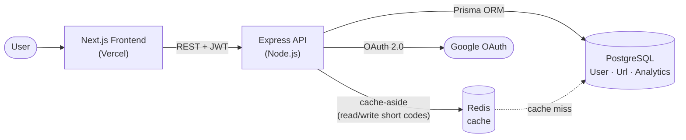

# SnapLink — Scalable URL Shortener

A high-performance, production-ready URL shortener built with a modern full-stack architecture. This project demonstrates advanced backend concepts including caching, rate limiting, and relational database management.

## 🚀 Tech Stack

| Layer | Technology |
|---|---|
| **Frontend** | Next.js 14 (App Router, TypeScript, Tailwind CSS) |
| **Backend** | Node.js + Express (ESM) |
| **Database** | PostgreSQL + Prisma ORM |
| **Cache** | Redis (cache-aside pattern) |
| **Auth** | Google OAuth 2.0 + JWT |
| **Infra** | Docker Compose |

## 🏗️ Architecture



**Redirect path:** `GET /:shortCode` → check Redis → on a hit, redirect immediately; on a miss, read Postgres, warm the cache, then redirect. Either way a click is recorded in `Analytics`. Expired links return `410 Gone` and are evicted from the cache. If Redis is down, the API falls back to Postgres and keeps serving.

## ✨ Features

- **Base62 Short Codes** — nanoid-powered 7-char codes using `0-9a-zA-Z` alphabet, collision-resistant with up to 5 re-rolls
- **Custom Aliases** — create memorable short links like `/my-link`
- **Link Expiration** — optionally set a link to expire (1 / 7 / 30 days); expired links return `410 Gone` and are evicted from the cache
- **Redis Caching** — cache-aside redirects for sub-millisecond response times; graceful fallback to Postgres if Redis is unavailable
- **QR Code Generation** — every short URL gets an auto-generated QR code (PNG or data URL)
- **Click Analytics** — track total clicks, browsers, devices, and referrers per URL
- **Google OAuth + JWT** — one-click sign-in, JWT token valid for 7 days, used on all protected routes
- **Rate Limiting** — 20 URL creates/hour per IP, plus a global 200 requests/15min cap
- **Dashboard** — manage all your links, view stats, delete URLs

## 📁 Project Structure

```
url-shortener/
├── Backend/
│   ├── src/
│   │   ├── app.js                  # Express app + middleware
│   │   ├── config/
│   │   │   ├── db.js               # Prisma client
│   │   │   ├── redis.js            # Redis client (resilient)
│   │   │   └── passport.js         # Google OAuth strategy
│   │   ├── controllers/
│   │   │   ├── urlController.js    # Shorten, redirect, QR, stats
│   │   │   └── userController.js   # User URL management
│   │   ├── middleware/
│   │   │   ├── auth.js             # JWT verification
│   │   │   └── rateLimiter.js      # express-rate-limit configs
│   │   ├── routes/
│   │   │   ├── authRoutes.js       # /auth/google, /auth/me
│   │   │   ├── urlRoutes.js        # /url, /url/:code/qr, /url/:code/stats
│   │   │   └── userRoutes.js       # /user/urls
│   │   ├── services/
│   │   │   └── base62Service.js    # Collision-resistant code generation
│   │   └── utils/
│   │       └── generateShortCode.js# nanoid Base62 generator
│   ├── prisma/
│   │   └── schema.prisma           # User, Url, Analytics models
│   ├── server.js
│   └── Dockerfile
├── Frontend/
│   └── url-shortener-frontend/
│       ├── src/
│       │   ├── app/
│       │   │   ├── page.tsx            # Landing page
│       │   │   ├── dashboard/page.tsx  # User dashboard
│       │   │   ├── stats/[shortCode]/  # Analytics page
│       │   │   └── auth/callback/      # OAuth callback
│       │   ├── components/
│       │   │   ├── Navbar.tsx
│       │   │   ├── UrlShortenerForm.tsx
│       │   │   └── UrlCard.tsx
│       │   ├── context/AuthContext.tsx
│       │   └── lib/api.ts
│       └── Dockerfile (in Frontend/)
└── docker-compose.yml
```

## 🛠️ Setup

### Prerequisites
- Node.js 20+
- PostgreSQL
- Redis (optional — app works without it, just slower)
- Google OAuth credentials

### 1. Configure environment

```bash
# Backend
cp .env.example Backend/.env
# Fill in: GOOGLE_CLIENT_ID, GOOGLE_CLIENT_SECRET, JWT_SECRET

# Frontend
echo "NEXT_PUBLIC_API_URL=http://localhost:5000" > Frontend/url-shortener-frontend/.env.local
```

### 2. Run database migrations

```bash
cd Backend
npx prisma migrate dev
```

### 3. Start backend

```bash
cd Backend
npm run dev
```

### 4. Start frontend

```bash
cd Frontend/url-shortener-frontend
npm run dev
```

## 🐳 Docker (recommended)

```bash
# Create root .env from template
cp .env.example .env
# Fill in at least POSTGRES_PASSWORD and JWT_SECRET

docker compose up --build
```

| Service | URL |
|---|---|
| Frontend | http://localhost:3000 |
| Backend API | http://localhost:5000 |
| PostgreSQL | localhost:5435 |
| Redis | localhost:6379 |

Compose applies any pending Prisma migrations before the API starts, and the
frontend waits for the backend's `/health` check to pass before booting.

## 🚀 Deploying

### 1. Set the production environment

`NODE_ENV=production` turns on strict startup validation — the API refuses to
boot if `DATABASE_URL`, `JWT_SECRET`, `BASE_URL` or `FRONTEND_URL` is missing,
or if `JWT_SECRET` is shorter than 32 characters or still the placeholder. This
is deliberate: the code carries a development fallback secret, and booting with
it in production would let anyone forge a login token.

```bash
# Generate a real secret
openssl rand -base64 48
```

### 2. Point the URLs at your real domains

| Variable | Purpose |
|---|---|
| `BASE_URL` | Origin used to build returned short links |
| `FRONTEND_URL` | Allowed CORS origin |
| `GOOGLE_CALLBACK_URL` | Must match the redirect URI registered in Google Cloud Console |
| `NEXT_PUBLIC_API_URL` | API origin the browser calls |

`NEXT_PUBLIC_*` values are compiled into the browser bundle at **build time**,
so `NEXT_PUBLIC_API_URL` is passed to the frontend image as a build arg.
Changing it requires rebuilding the frontend — setting it only at runtime has
no effect.

```bash
docker compose build --build-arg NEXT_PUBLIC_API_URL=https://api.example.com frontend
```

### 3. Behind a reverse proxy

Set `TRUST_PROXY` to the number of proxies in front of the API (defaults to `1`
in production). This is what lets rate limiting key on the real client IP
instead of lumping every visitor into one bucket. Set it to `0` if the API is
exposed directly.

### 4. Operational notes

- **Health check:** `GET /health` returns status and uptime.
- **Graceful shutdown:** SIGTERM/SIGINT drain in-flight requests and close the
  DB and Redis handles before exit, so deploys don't drop live requests.
- **Migrations:** run `npm run migrate:deploy` from `Backend/` if you deploy
  outside Compose.
- **Database port:** Compose binds Postgres and Redis to `127.0.0.1` so they
  are not publicly reachable on a deployed host.
- Both containers run as non-root users.

## 🔌 API Reference

| Method | Endpoint | Auth | Description |
|---|---|---|---|
| `POST` | `/url` | Optional | Create short URL (body: `longUrl`, optional `customAlias`, optional `expiresAt` ISO date) |
| `GET` | `/:shortCode` | — | Redirect to original URL (`410` if the link has expired) |
| `GET` | `/url/:shortCode/qr` | — | QR code — PNG by default, `?format=dataurl` for a JSON data URL |
| `GET` | `/analytics/:shortCode` | Optional | Click analytics for one URL (owner-only if the link belongs to a user) |
| `GET` | `/analytics/dashboard` | Required | Summary stats across the caller's URLs |
| `GET` | `/auth/google` | — | Start OAuth flow |
| `GET` | `/auth/google/callback` | — | OAuth callback |
| `GET` | `/auth/me` | Required | Current user |
| `GET` | `/user/urls` | Required | List my URLs |
| `DELETE` | `/user/urls/:shortCode` | Required | Delete my URL |
| `GET` | `/health` | — | Health check |

## 🚢 Deployment

| Service | Platform |
|---|---|
| Frontend | Vercel |
| Backend + DB | render |
| Redis | render |

Remember to update `GOOGLE_CALLBACK_URL` in Google Cloud Console to your production backend URL.
